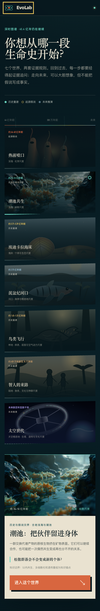

# 最终前端与中文文案验收

最终发布面向第一次打开项目的评委。页面只做一件事：从七个世界选定起点，沿“环境—偶发事件—演化方向”推进三轮，再回看四阶段谱系。

视觉继续使用深渊蓝、化石纸、菌膜青和铁锈橙。标题承担自然史档案感，正文负责阅读，年代与证据模式使用数据字体。标志性元素是贯穿七世界的“证据地层线”和三段选择之间的“选择压力线”，它们都对应真实规则，不是装饰。

## 文案复核

| 改前 | 最终发布文案 |
|---|---|
| 四个世界，四套起点和规则 | 七个世界，两套证据规则。 |
| 哪些后代会留下更多 | 这组条件更支持哪些方向 |
| 正在加载 | 正在根据当前环境重算候选… |
| 在 DGX 上运行 | Klein 三轮约 5.01 秒；失败回到 FLUX.1；Hunyuan 任务记录统一内存峰值。 |

`humanizer-zh` 自评为 48 / 50：直接性 10、节奏 9、信任度 10、真实性 10、精炼度 9。文案说明测量对象、失败边界和证据级别，不把生成图片写成科学发现。

## 浏览器验收

| 检查 | 结果 |
|---|---|
| 桌面 | 1440 × 1000；`scrollWidth === clientWidth === 1440` |
| 手机 | 393 × 659 视口；整页 393 × 2396；无横向溢出 |
| 键盘 | 首个 Tab 落在页头返回链接，焦点轮廓为 `solid` |
| 降低动态效果 | 媒体查询命中；平滑滚动关闭；背景动画缩短到 `0.00001s` |
| 控制台 | 桌面、手机与降低动态效果上下文均为 0 error、0 warning |

