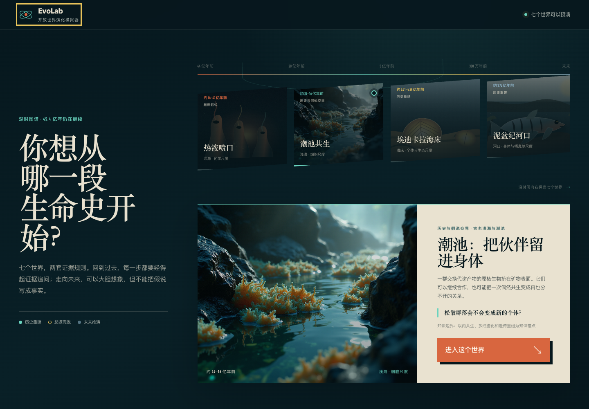
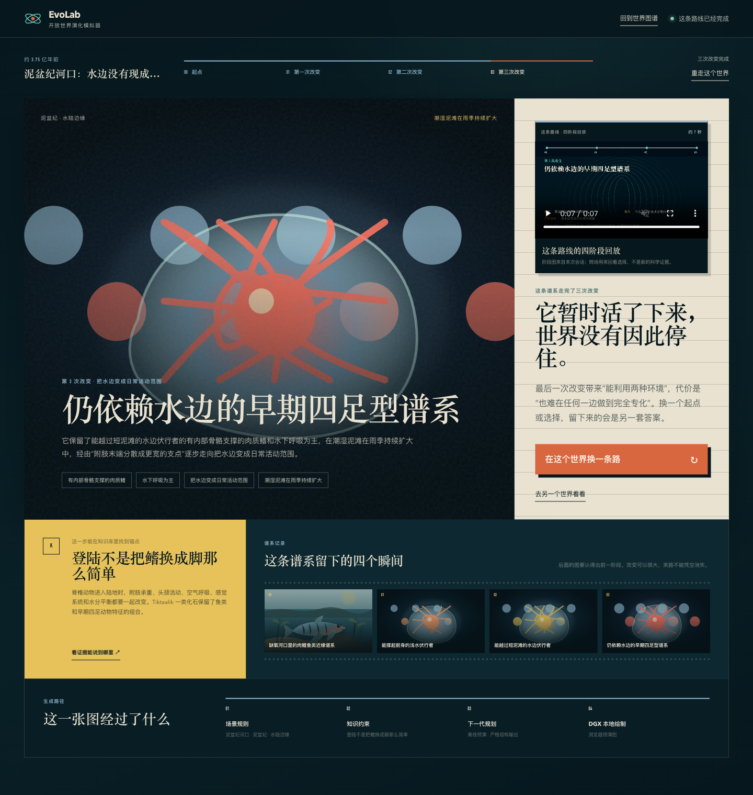
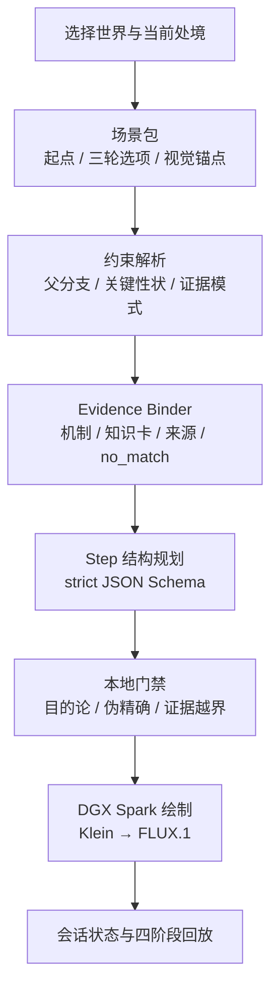
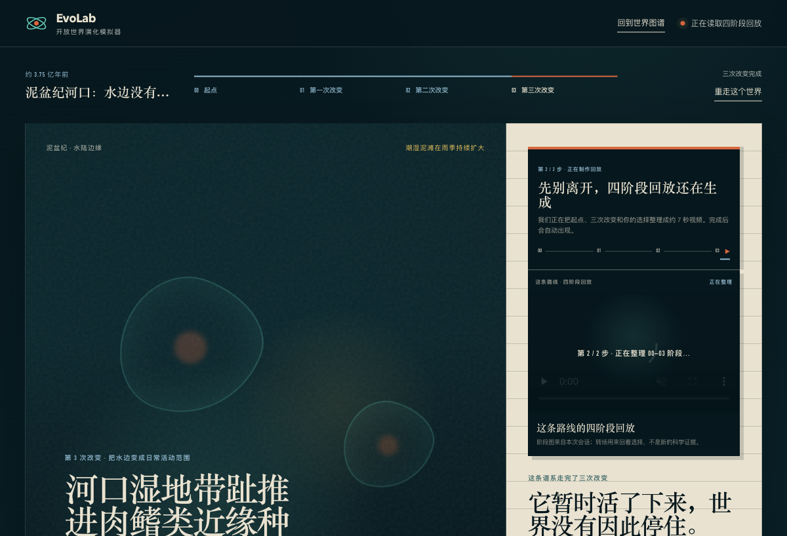
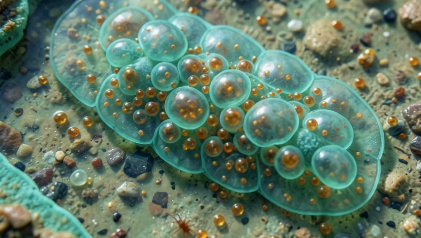

# DGX Spark 黑客松十日谈｜EvoLab：让演化留下来路

> 十天里，我们做成了一款开放世界演化模拟器。你改变环境和偶然事件，系统保留已经发生的历史，再生成下一阶段。每次变化都有收益，也有代价。

- [观看 90 秒有声作品介绍](../demo-assets/submission/evolab-90s-introduction.mp4)
- [打开最终提交说明](submission.md)



十天里当然有报错、回退和熬夜，但这些不构成作品。本文只讲最后留下的东西。

EvoLab 的成品是一张从前生命化学延伸到未来太空的深时图谱。图谱上有七个可以进入的世界。每个世界都能连续推进三轮，起点和三次改变会被保存成四阶段谱系。

一句话概括：

> 从生命史的任意一处开始，改变环境和偶然事件，看一条谱系怎样带着旧痕迹、付出代价，走向下一阶段。

## 为什么想做 EvoLab

生成一张陌生生物并不难。难的是第二张。

上一轮已经长出的结构还在不在？新的环境压力与形态变化有没有关系？模型说它“更适应”，到底换来了什么，又牺牲了什么？如果给出一条来源，那条来源支持的是一般机制，还是眼前这只生成生物真的存在？

这些问题决定了 EvoLab 的方向。我们没有把演化写成一棵从低级通往高级的升级树，而是把它拆成一组带前置条件的转变。简单结构、水生生活、无性繁殖或没有大脑，都可能是长期有效的路线。

系统反复使用同一条因果链：

```text
父代谱系与可遗传差异
+ 环境压力
+ 历史偶然
→ 候选性状变化
→ 生存或繁殖收益
→ 能量、结构或行为代价
→ 下一阶段谱系
```

它限制了模型，也让用户的选择真正有了分量。

## 十天后，我们交付了什么

首页不是常见的功能卡片墙，而是一条深时剖面。用户可以进入七个世界：

1. 热液喷口：生命门槛之前；
2. 潮池共生：把伙伴留进身体；
3. 埃迪卡拉海床：猎手出现以前；
4. 泥盆纪河口：水边没有现成的路；
5. 智人的来路：没有一条笔直阶梯；
6. 鸟类飞行：羽毛先出现，飞行后来才接手；
7. 太空世代：身体会跟着栖息地改变吗？

进入一个世界后，用户每轮只做三次选择：环境发生什么变化，这一轮碰上什么偶然事件，哪类差异更容易延续。提交后，系统生成下一阶段图片、收益与代价，并在合适的位置打开知识卡。

三轮之后，页面不会突然停在一张“终极形态”上。它会播放本次会话的四阶段回放，把起点、三次选择和留下的变化重新串起来。那是一条由用户亲手走出来的路线，不是预先剪好的宣传片。



## 整体架构：一条证据约束的生成链

要讲清这套系统，先抓住三个抽象：

> 世界是规则包，谱系是状态，图片是结果的表达。

这三句话分别解决扩展、连续和证据边界。它们落到系统里，是下面这条链路：



### 世界是可以运行的规则包

七个入口背后有七份独立场景数据。每份数据都包含时代、栖息地、起点、三轮环境、偶发事件、演化方向、知识卡、收益、代价和禁用视觉元素。

这让不同世界拥有不同语言。热液喷口在跨过生命门槛前，只能谈化学系统、反应网络和循环；泥盆纪河口要把呼吸、承重、保水与繁殖依赖拆开；未来太空则必须区分个体反应、技术补偿和跨世代遗传变化。

新增世界时，会话引擎不用跟着膨胀。首页从注册表读取世界坐标，引擎按 `scenario_id` 加载规则，知识层再按场景、轮次和方向绑定证据。

### 谱系是状态，不是一段越写越长的提示词

每轮结果都会写入会话：父代是谁，保留了哪些性状，用户选了什么，获得什么收益，付出什么代价，命中了哪张知识卡，图片保存在什么位置。

历史世界还有一份 `protected_traits` 账本。关键结构一旦出现，后续阶段不能凭空删除。只有场景包声明了有依据的 `trait_transformations`，旧结构才可以逐步转成新的形态。

父分支条件也会参与选项过滤。如果前一轮没有进入相应路线，下一轮不会突然出现只属于另一条谱系的能力。用户看到的自由，建立在当前状态确实可达的范围内。

### 图片负责呈现，不能替科学结论背书

Step 3.7 Flash 把用户选择整理成严格 JSON，包括名称、性状、内部原因、外部压力、收益、代价、不确定性和图像提示。本地门禁继续检查目的论、伪精确数字、语言和证据越界。

结构通过后，DGX Spark 上的 ComfyUI 才开始生成图片。图片可以决定纹理、颜色和局部外观，不能决定一条演化路线是否真实存在。知识层也不会给未知节点补造引用；找不到对应证据时，它返回 `no_match`。

## 历史和未来，不能共用一把尺子

历史重建关心可达性。鸟类路线把简单丝状羽、分叉保温羽、气动羽片和动力飞行分开；智人路线使用带基因流的种群网络，不画“猿到人”的直线队列。

未来推演没有唯一终点。太空世代可以讨论部分重力、辐射、种群隔离和基因流，但所有结果都标记为 `SCENARIO_EXTRAPOLATION`。航天研究支持的是现实生理压力，不能顺手证明数百代后的身体。

潮池世界的最后一轮也遵守同样边界。海水升温可以引用现实资料，具体出现哪种耐热形态仍是一次受约束的推演。

这套双约束不是文案补丁。它进入了场景数据、选项过滤、状态字段、知识卡和测试用例，所以模型换了，边界仍然在。

## 从 AI for Science 借来的，不是标签，而是方法

EvoLab 不是科学发现平台，也不预测新的生物学结论。我们借用了 AI for Science 处理模型结果时的几条工作经验。

第一，模型输出先被当作候选。用户给出环境和方向，Step 形成下一阶段草案；场景规则、父代条件和关键性状再判断它能否进入当前谱系。草案没有自动通行权。

第二，先缩小问题，再让模型生成。场景包给出可达范围，知识层提供机制和边界，模型在这个范围内组织结果。相比一段包办所有知识的长提示词，这种分工更容易检查，也更容易替换模型。

第三，结果与依据一起保存。会话记录选择、状态、知识命中、来源 ID 和图片哈希。用户看到的是简短解释；系统留下的是可以复核的路径。

第四，把不确定性写进产品。已知机制、仍在研究的机制、竞争假说、教学简化、未来推演和艺术表达使用不同标签。没有参数支持时，系统不会生成“73% 会演化成功”这样的数字。

这套方法还给未来留下了清楚的接口：独立生物 RAG 可以扩展证据范围，科学审查 Agent 可以对候选路线做第二次裁决，生态模型和实验数据则能把部分世界推向更细的参数化模拟。EvoLab 借的是工作方式，并准备沿着这条路继续生长。

## 一个差点被画没的关键性状

最能说明这套架构价值的，不是一次顺利生成，而是泥盆纪路线里的一次失败。

早期版本中，生物已经在第二轮获得了承重附肢。第三轮继续向浅滩推进时，渲染器却把腿画没了，又退回一条普通鱼。文字说它继续登陆，图片却把历史清空。

只修改提示词不够。我们把问题拆成三个层面：

- 状态层增加 `protected_traits`，记录已经获得的关键结构；
- 场景层增加 `trait_transformations` 和父分支条件，明确哪些结构可以怎样变化；
- 渲染层从第二阶段开始上传父代图作为参考，同时传入附肢数量、位置和禁止回退约束。

修复后的真实 DGX 会话走完三轮。肉质鳍逐步变成浅水承重附肢、湿泥推进附肢和带趾支点，四个附肢的位置与数量保持连续。参考图解决的是画面继承，规则账本负责科学连续性，两者没有混在一起。



## DGX Spark 在项目里做了什么

DGX Spark 没有被用来在十天里仓促训练一个新基础模型。它是本地生成与服务节点：运行 ComfyUI 和 FLUX，保存会话与阶段图，生成四阶段回放，并完成 HunyuanVideo I2V 实测。

FLUX.2 Klein 4B 经过四个世界、两个固定种子的 8 组盲评，结果 8/8 不劣于 FLUX.1。浅海三轮生成 1024×1024 图片，单轮热运行约 5.01 秒。注入 Klein 提交失败后，FLUX.1 在约 30.02 秒完成了真实回退。

HunyuanVideo-1.5 使用一张已验收的最终阶段图，生成 848×480、81 帧、24 fps 的 3.375 秒视频，耗时 242.453 秒。它是一段独立的动态留档，不是四阶段演化，也没有被包装成新的科学证据。



设备侧的意义很实际：模型、图片和会话结果留在本地；图片与视频任务可以串行调度；Klein 与 FLUX.1 拥有明确切换和回退路径。现场演示需要的不是一张极限跑分，而是一条能完成、能恢复的链路。

## 十天里真正值得保留的经验

开发经历只说两件事。

第一，生成式项目越接近演示，越需要先保护已经验证的路径。Klein 通过门禁后成为比赛实例的优先渲染器，FLUX.1 仍完整保留。HunyuanVideo 只做独立资产，不进入三轮实时路径。新模型带来速度，回退方案保证项目能交付。

第二，失败状态也是产品状态。真实三轮验收中，第二轮曾收到一次无效规划输出。服务端没有覆盖第一轮结果，页面保留选择，重试后继续完成。对观众来说只是一次可以恢复的失败；对系统来说，这比“每次都假装成功”更重要。

## 从十天作品走向开放世界底座

七个世界已经共用同一套注册、会话、规划、知识、渲染和回放接口。Klein 的 A/B、三轮与 FLUX.1 回退有独立运行记录；HunyuanVideo 也保存了输入哈希、参数、耗时、内存与逐帧检查结果。

这意味着 EvoLab 已经不只是一条潮池故事。新增雪球地球、煤纪森林、白垩纪海岸或未来城市生态时，只需补充世界规则、知识节点与视觉锚点，底层引擎可以继续复用。

接下来，文件化知识层会继续生长为独立生物 RAG 和证据账本；科学审查 Agent 可以在绘图前否决越界路线；有限类群还可以接入种群遗传、生态模型或实验数据。十天做成的是第一层产品，也是后续世界扩张的底座。

## 结语

十天前，我们手里是一条已经跑通的 Workshop 基线。十天后，EvoLab 有了七个世界、三轮状态、知识边界、历史与未来两套约束、本地图像生成、真实回退和一段可以回看的谱系。

它没有回答生命会走向哪里。用户每改变一次环境，系统只负责把问题收窄：在这段历史、这组条件和这副身体之下，下一步有哪些可能；哪些旧痕迹还得带着；得到新能力时，又要付出什么。

这就是 EvoLab 最终做成的东西。

---

- 项目仓库：https://github.com/boblank/DGXSparkSandEvo
- 运行平台：NVIDIA DGX Spark
- 主要模型：Step 3.7 Flash、FLUX.2 Klein 4B、FLUX.1、HunyuanVideo-1.5
- 项目协议：MIT License
