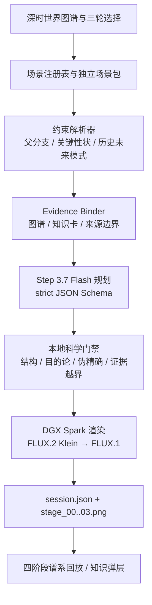

# EvoLab｜演化岔路：开放世界演化引擎

> 一款运行在 NVIDIA DGX Spark 上的开放世界演化模拟器。用户改变环境、偶发事件和演化方向，系统保留谱系历史，用知识与规则约束下一阶段，再在本地生成图片和四阶段回放。

- 开源仓库：[boblank/DGXSparkSandEvo](https://github.com/boblank/DGXSparkSandEvo)
- 90 秒有声演示：[evolab-90s-introduction.mp4](../demo-assets/submission/evolab-90s-introduction.mp4)
- “十日谈”开发征文：[DGX Spark 黑客松十日谈](hackathon-ten-days.md)
- 开源协议：MIT License
- 作品形态：三轮有状态网页交互 + 四阶段谱系回放 + DGX 本地图像生成
- 最终提交版本：`v1.0.0-submission`，七世界、历史/未来双约束版

## 一、作品概览

很多生成式演化应用把提示词交给模型，然后等待一张足够奇特的生物图。EvoLab 处理的是更难的一部分：这一轮发生的变化，怎样从上一轮走来；哪些旧性状必须留下；新能力带来了什么收益，又付出了什么代价。

用户先进入一张横跨深时与未来的世界图谱，从七个独立世界中选择起点：

| 世界 | 体验尺度 | 核心问题 |
|---|---|---|
| 热液喷口 | 前生命化学 | 反应网络怎样保存差异并跨过循环 |
| 潮池共生 | 微生物与细胞 | 共生关系怎样逐渐进入细胞内部 |
| 埃迪卡拉海床 | 早期动物生态 | 捕食出现后，柔软海床怎样改变 |
| 泥盆纪河口 | 水陆过渡 | 水中的身体怎样逐步获得浅滩承重能力 |
| 智人的来路 | 人族种群网络 | 双足、工具和种群交流怎样共同作用 |
| 鸟类飞行 | 羽毛与气动控制 | 羽毛怎样从保温、展示走向飞行 |
| 太空世代 | 多代未来推演 | 可塑性、技术补偿和遗传变化如何区分 |

进入世界后，用户连续完成三轮选择：环境正在怎样变化，这一轮偶然发生了什么，哪类差异更容易延续。系统生成下一阶段图像与解释，并把结果带进下一轮。起点加上三轮结果，最终形成四张连续的谱系记录。

```text
环境变化
+ 历史偶然
+ 父代谱系与可遗传差异
→ 候选性状变化
→ 适应收益与生存代价
→ 下一阶段谱系
```

EvoLab 面向科学教育、博物馆互动、课堂探究和公众传播。它把生成模型从“画一张陌生生物”推进到“运行一段有历史、有约束、可解释的世界状态”，也为后续接入更精细的生态模型和科研数据留下接口。

## 二、作品特点与核心亮点

### 1. 七个入口背后是七套规则

七个世界不是换封面后的同一个流程。每个场景包都保存独立的起点、三轮选项、前置条件、知识卡、证据标签、视觉锚点和禁用元素。新增世界只需登记场景包，不必修改会话引擎。

这种结构把“开放世界”从内容数量变成了系统能力。热液喷口不能提前出现“物种”和“后代”；鸟类世界不会把羽毛与动力飞行压成一步；太空世代也不会用航天员的短期生理反应证明未来人类已经发生遗传演化。

### 2. 谱系状态会真正继承

系统为每轮保存 `lineage_parent`、`inherited_traits` 和 `protected_traits`。历史场景还会检查父分支前置条件与允许发生的 `trait_transformations`。一个已经出现的承重附肢，不能在下一轮无故退回普通鱼鳍。

继承也不是把旧特征原样复制。场景包可以声明有依据的结构转化，例如“浅水承重附肢”逐步变成“湿泥短距推进附肢”。系统保存旧痕迹，同时允许结构继续变化。

### 3. 历史重建与未来推演使用两套约束

历史路线检查“前一步是否能够到达后一步”，重点是父代条件、关键性状连续和来源边界。未来路线回答“在给定压力下可能出现什么”，强制标记为 `SCENARIO_EXTRAPOLATION`，并区分个体可塑性、工程补偿与许多代后的遗传变化。

这套分工避免了常见混淆：现实环境压力可以有来源，模型生成的具体未来身体仍然只是情景推演。来源支持哪句话，不能顺便替整张图背书。

### 4. 生成、知识与证据各管一段

EvoLab 的知识层由场景规则、轻量演化图谱、知识卡和人工筛选来源组成。已知节点会返回对应解释与来源；未知节点明确返回 `no_match`，不会为了让页面看起来完整而补造引用。

Step 规划器负责把用户选择写成严格结构，包括名称、性状、收益、代价、不确定性和图像提示。它不决定引用。图片模型负责把已经通过结构检查的结果画出来，也不反向裁定生物学结论。

### 5. 本地图像生成有主路径，也有退路

比赛实例优先使用 FLUX.2 Klein 4B Distilled FP8。固定提示的 8 组盲评中，Klein 8/8 不劣于 FLUX.1；浅海三轮实测均生成 1024×1024 PNG，热运行单轮约 5.01 秒。

FLUX.1 工作流没有被删除。注入 Klein 提交失败后，系统实际回退到 FLUX.1，并在约 30.02 秒后得到合格图片，记录 `fallback_from=flux2-klein-4b`。模型升级因此不会把现场演示变成一次押注。

## 三、整体技术架构



这条链路可以理解为一次受约束的编译：用户选择是输入，场景与知识层给出可用边界，规划器产出严格结构，DGX Spark 再把结构渲染成图像。每个阶段都有可核对的中间产物，不需要展示模型的隐藏思维过程。

### 核心组件

| 组件 | 当前职责 | 状态 |
|---|---|---|
| 场景注册表 | 管理世界入口、时代、封面和场景包 | 已实现，7 个世界 |
| 约束解析器 | 过滤不满足前置条件的选择，维护关键性状账本 | 已实现 |
| Evidence Binder | 返回机制、权衡、知识卡、来源或 `no_match` | 已实现，文件版 |
| Step 规划器 | 严格结构化下一阶段与图像提示 | 已实现 |
| 本地科学门禁 | 检查 Schema、目的论、伪精确和证据越界 | 已实现基础规则 |
| FLUX.2 Klein 渲染器 | 生成阶段图，历史路线可使用父图参考 | 已通过 A/B、三轮和回退门禁 |
| FLUX.1 渲染器 | 独立稳定回退；第二、三轮继续读取父图 latent | 已实现并通过 DGX 实机工作流验证 |
| 四阶段回放 | 读取真实会话的四张图与三轮中文选择 | 已实现 |
| HunyuanVideo I2V | 从验收图生成独立短动态资产 | 已跑通，不进入实时主链 |
| 科学审查 Agent | 只读草案、性状账本、场景规则和证据包；可通过、要求一次修订或阻断 | 已接入主链，阻断发生在绘图前 |
| 图像连续性审查 | 结构门禁后比较父图与候选图，核对身份、关键性状和禁画项 | 已接入 Step 多模态 Adapter；不可用时明确标成技术检查 |

## 四、智能体融合与模型优化

### 1. 有边界的规划 Agent

当前主链使用 `step-3.7-flash`，设置 `reasoning_effort=high`，输出采用 `strict=true` 的 JSON Schema。规划结果只有通过字段、语义和中文文案检查后，才能写入会话并进入绘图。

会话锁、知识查询、来源绑定、渲染和文件校验由确定性 Module 承担，规划 Agent 只处理需要语义理解与结构生成的部分。职责收窄以后，系统更容易定位问题；规划服务暂时不可用时，上一阶段也不会被覆盖。

### 2. 约束推理代替临时微调

十天窗口内没有在 DGX Spark 上微调基础模型。项目把优化集中在输入契约、状态继承、规则门禁和模型路由上：场景包缩小候选空间，Strict Schema 固定输出结构，Evidence Binder 负责来源，渲染器只接收已经过审的图像提示。

这种做法减少了自由文本漂移，也把科学错误拦在 GPU 绘图之前。模型输出无效时，当前会话保留原状态，用户可以重试；第二轮真实验收中曾触发一次 `planner_invalid_output`，重试后继续完成三轮。

### 3. 图像模型的 A/B 与回退门禁

Klein 的引入经过固定提示、固定尺寸、双种子盲评、真实三轮、冷/热运行与故障注入。历史路线从第二阶段起可上传父代图片作为参考，同时加入关键性状账本和禁止回退提示，用来降低谱系漂移。

系统不会把图像相似度当成科学证据。参考图只解决视觉连续性，生物学可达性仍由场景规则、状态账本和知识边界决定。

## 五、DGX Spark 的平台作用

DGX Spark 在项目中承担本地推理主机、会话服务和媒体生产节点。每轮 FLUX 图片、会话状态、四阶段回放与独立 HunyuanVideo 动态资产都保留在设备侧；Step API Key 只存在于服务端环境，浏览器无法读取。

本项目先完整复现组织方 OpenClaw + Ollama/Qwen + ComfyUI/FLUX Workshop 基线，26/26 个 Notebook 代码单元执行完成，错误输出为 0。在此基础上，比赛主链改为网页会话、严格规划、规则检查和本地图像生成。

真实设备记录包括：

- FLUX.2 Klein 4B：三轮 1024×1024 图片分别耗时 5.015、5.014、5.013 秒；
- FLUX.1 故障回退：1024×1024 图片耗时 30.023 秒；
- HunyuanVideo-1.5：848×480、81 帧、24 fps、8 步，生成 3.375 秒 H.264 视频耗时 242.453 秒；
- HunyuanVideo 记录了输入哈希、完整运动提示、进程内存、逐帧检查和人工联系表结果。

HunyuanVideo 的短片只说明设备侧 I2V 链路已经跑通。它从一张最终阶段图生成运动，不承担四个阶段之间的演化叙事，也不增加新的科学证据。

## 六、状态、接口与可靠性

每个会话拥有独立目录和 `scenario_id`。`expected_round` 用来拒绝重复点击和过期请求；一轮失败时，已经完成的谱系、用户选择和图片不会被覆盖。

主要接口：

```text
GET  /api/health
GET  /api/scenarios
POST /api/sessions
GET  /api/sessions/{session_id}
POST /api/sessions/{session_id}/evolve
GET  /api/sessions/{session_id}/lineage-video
GET  /api/assets/{session_id}/{filename}
```

静态服务只开放 `demo-ui/`、`demo-assets/` 和受控图片接口。`.env`、源码、运行目录、内部文档与路径穿越请求会被阻断。下游错误会转换成简短中文提示，不回显请求头、原始响应或密钥。

离线预演与真实模式使用同一页面、同一场景包和同一 API。离线模式只替换规划与图片生成，用于断网演示和界面验收；它不是另一套只供录屏的假页面。

## 七、部署说明

### 1. 环境要求

- NVIDIA DGX Spark 与 CUDA 环境；
- 组织方 Workshop Bundle，或可访问的 ComfyUI 实例；
- Python 3；
- FLUX.2 Klein 4B Distilled FP8 与 FLUX.1 对应工作流和模型资产；
- 可选：HunyuanVideo-1.5 480p I2V Step Distilled FP8；
- Step API Key，通过服务端环境安全注入。

### 2. 离线界面验收

```bash
git clone https://github.com/boblank/DGXSparkSandEvo.git
cd DGXSparkSandEvo
python3 -m venv .venv
source .venv/bin/activate
python -m pip install -r requirements.txt
python3 demo-ui/server.py --host 127.0.0.1 --port 8088 --dry-run
```

浏览器打开：

```text
http://127.0.0.1:8088/demo-ui/
```

### 3. DGX Spark 真实运行

```bash
export STEP_API_KEY='从安全环境注入，不写入仓库或日志'
export COMFYUI_URL='http://127.0.0.1:7000'
export EVOLAB_IMAGE_RENDERER='flux2-klein-4b'
export EVOLAB_IMAGE_FALLBACK='flux1'
python3 demo-ui/server.py --host 127.0.0.1 --port 8088
```

启动后先检查：

```bash
curl -fsS http://127.0.0.1:8088/api/health
```

若 Klein 加载、提交或生成失败，渲染层会转入 FLUX.1。HunyuanVideo 只用于预生成演示资产，即使不可用，也不会阻断三轮交互。

## 八、技术栈

| 分类 | 技术 |
|---|---|
| NVIDIA 平台 | DGX Spark、CUDA 运行环境与统一内存；本地承载 ComfyUI、会话服务和媒体任务 |
| Stepfun | Step 3.7 Flash（结构规划）；StepAudio 2.5（提交视频旁白） |
| 结构规划 | Step 3.7 Flash、High reasoning、Strict JSON Schema |
| 本地语言模型基线 | Ollama + Qwen3.6 35B，用于官方 Workshop 复现与 CLI 回退验证 |
| 图像生成 | ComfyUI、FLUX.2 Klein 4B Distilled FP8、FLUX.1 dev FP8 |
| 视频生成 | HunyuanVideo-1.5 480p I2V Step Distilled FP8 |
| Agent 能力 | Evolution Skill、OpenClaw 基线链路 |
| 后端 | Python、标准库 HTTP 服务、文件会话状态 |
| 前端 | HTML、CSS、原生 JavaScript |
| 媒体与验证 | Pillow、PyAV / ffmpeg、H.264、自动化联系表与哈希记录 |
| 知识层 | 演化图谱、场景包、知识卡、人工筛选来源、确定性适配器 |

FLUX.1、FLUX.2 Klein 与 HunyuanVideo 都不是 NVIDIA 模型。本项目没有使用 NIM、TensorRT-LLM 或 NeMo，因此不把这些 SDK 写进已用技术栈。DGX Spark 的实际价值是让 ComfyUI、图片模型、视频模型、会话服务和产物留在同一台统一内存设备上，并按图片、回退、视频三类任务串行调度。

## 九、从作品走向演化世界底座

EvoLab 已经形成一套完整的世界扩展契约。一个新世界由场景包、知识节点、证据来源和视觉锚点组成，登记后即可复用同一套会话、规划、渲染与回放能力。新增雪球地球、煤纪森林或未来城市生态，不需要重新开发一套产品。

真实 DGX 会话已经走完潮池和泥盆纪三轮。泥盆纪会话从肉质鳍走到浅水承重、湿泥推进和带趾支点，第二、第三阶段都使用父图参考条件，四个附肢保持连续。

下一层将把当前轻量知识图谱升级为独立生物 RAG 与证据账本，并为科学审查和图像审查建立固定样本评测。再往后，有限类群可以接入种群遗传、生态模型或实验数据，让 EvoLab 从科学教育体验继续生长为可扩展的演化世界实验台。

## 十、可信生成也是产品能力

EvoLab 输出的是教学模拟与受约束的生成假说。三轮体验压缩了漫长历史，不代表真核化、多细胞化、登陆或飞行一定按这个顺序发生。

项目会明确区分已知机制、仍在研究的机制、竞争假说、教学简化、未来情景推演与艺术表达。没有完整种群遗传参数、化石校准和环境动力学时，界面不会显示“73% 演化成功”一类伪精确数字。

这套边界并没有削弱体验，反而让每一次生成更值得追问。用户看到图像，也能继续查看它根据什么生成、哪部分有来源、哪部分属于推演。对科学教育产品来说，可解释性本身就是可玩性的一部分。
